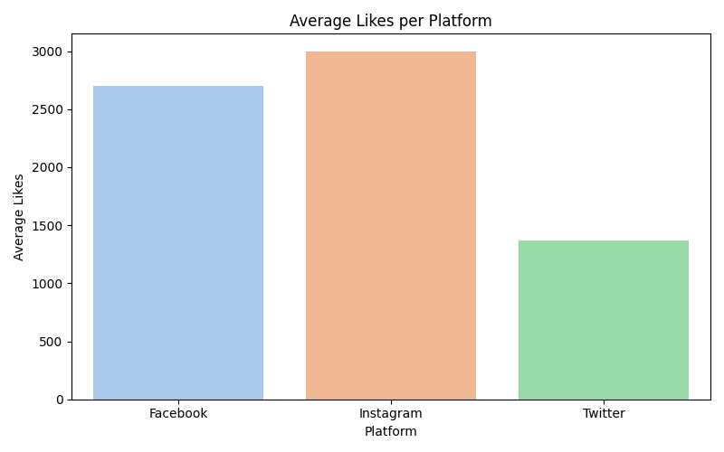
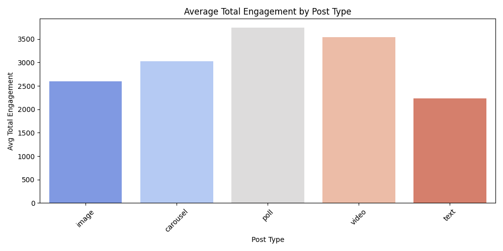
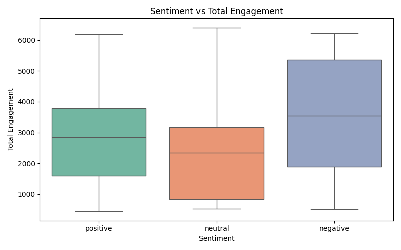

# 📊 Social Media Engagement Analysis

A beginner-friendly data analysis project using real social media post data from Facebook, Instagram, and Twitter.

---

## 📌 Objective
To explore how post type, sentiment, and time of posting affect likes, comments, and shares — using Python and Google Colab.

---

## 🗂️ Dataset
- File: `social_media_engagement1.csv`
- 100 posts (2023)
- Columns: platform, post type, sentiment score, likes, comments, shares, post time

---

## 📊 Key Insights
- 📅 **Thursday** and **Sunday** had the highest engagement
- 🖼️ **Carousel** and **Video** posts performed best
- 😊 **Positive sentiment** led to more engagement

---

## 🛠️ Tools Used
- Google Colab
- Python (Pandas, Seaborn, Matplotlib)

---

## 📈 Visualizations

#### 🔹 Average Likes by Platform

#### 🔹 Engagement by Post Type

#### 🔹 Sentiment vs Total Engagement

---

## 📁 Files
- `social_media_engagement1.csv`: Dataset
- `Social_Media_Engagement_Analysis.ipynb`: Analysis notebook

---

## 👤 Author
**Komala Abburi**  
Aspiring Data Analyst | Python Learner | Project-Based Learning Enthusiast
